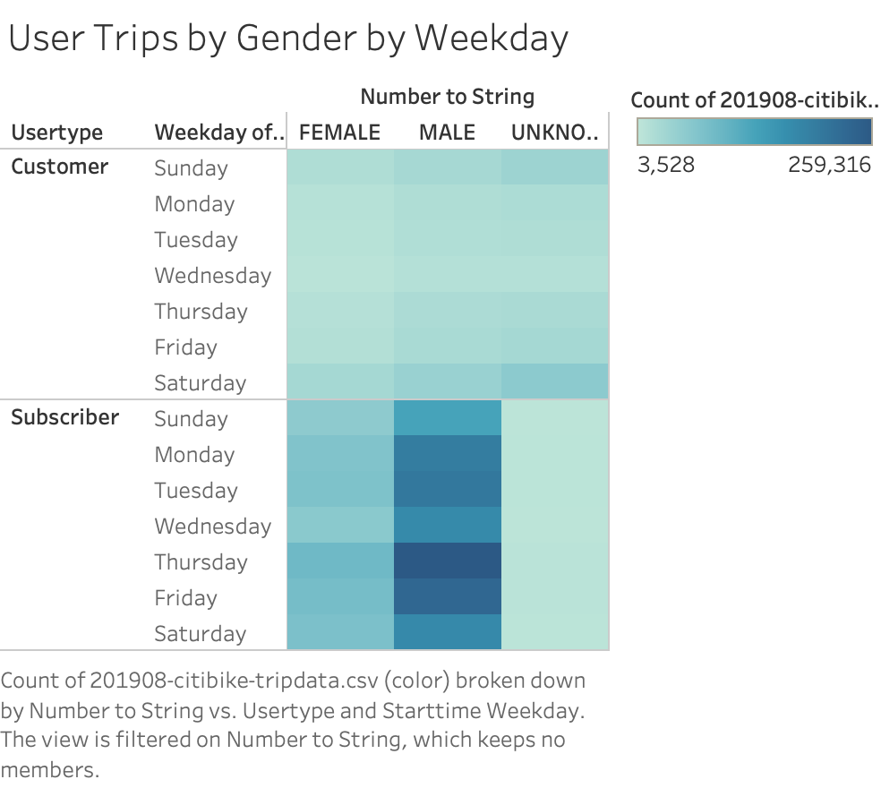

# bikesharing

## Overview 

The point of this project was to provide visualizaions and analysis of the provided bikesharing data to help solifidy a proposal to investors. 

## Results
[link to dashboard](https://public.tableau.com/shared/HXHR7BN9C?:display_count=y&:origin=viz_share_link)

[link to story](https://public.tableau.com/shared/7SCNBQX9B?:display_count=y&:origin=viz_share_link)

# Here are some of the examples of visualizations  made in the workbook 

---

---

---

## Summary
Overall it seems commuting hours have the highest usage with male users and subcribers being the most active users. Although male users ride the most, all genders show the same pattern. If given more time and data I would expand the analysis on the top stations to include details on how many bikes are at those stations on average  and if it is enough in comparison to the amount usually needed.
